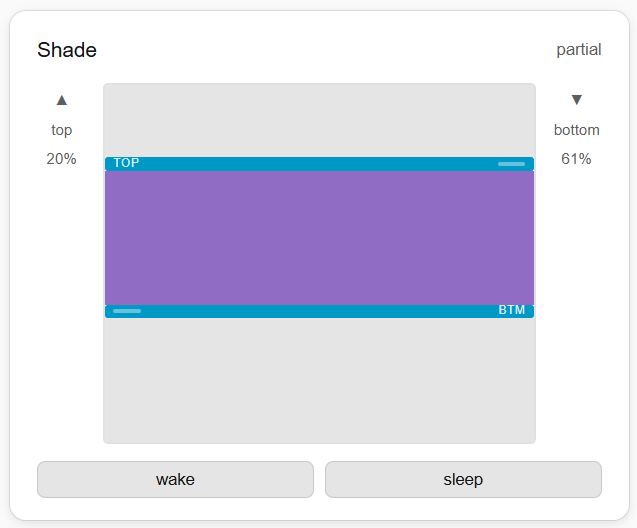

# TDBU Shade Card

A custom Home Assistant Lovelace card for controlling **Top Down Bottom Up (TDBU)** motorized shades, specifically designed for **Rollease Acmeda Pulse v2** hubs (sold under the Budget Blinds "Smart Home Collection" and Automate brands).



## What This Solves

TDBU shades have two independently controlled rails — a top rail that moves down and a bottom rail that moves up. The standard Home Assistant integrations treat these as a single cover entity, giving you no way to control each rail independently.

This card provides:
- A visual window representation showing both rails and the fabric between them
- Draggable handles for each rail — top rail on the left, bottom rail on the right
- Configurable scene preset buttons (wake, afternoon, evening, sleep — or whatever you define)
- Support for controlling multiple shades simultaneously from one card
- Real-time position feedback for each rail

---

## Prerequisites

Before using this card you need working dual-rail cover entities in Home Assistant. This requires patching the `aiopulse2` library and modifying the Automate Pulse Hub v2 custom integration. See the **Backend Setup** section below.

---

## Installation

### Via HACS (recommended)

1. In HACS, go to **Frontend → Custom repositories**
2. Add this repository URL and select **Lovelace** as the category
3. Install **TDBU Shade Card**
4. Hard refresh your browser (Ctrl+Shift+R / Cmd+Shift+R)

### Manual

1. Download `tdbu-shade-card.js`
2. Copy it to `/config/www/tdbu-shade-card.js`
3. In HA go to **Settings → Dashboards → Resources → Add Resource**
4. URL: `/local/tdbu-shade-card.js`, type: **JavaScript module**
5. Hard refresh your browser

---

## Card Configuration

Add the card to your dashboard using the YAML editor:

```yaml
type: custom:tdbu-shade-card
name: Office
entity_top: cover.office_top_rail
entity_bottom: cover.office_bottom_rail
presets:
  - name: wake
    top: 0
    bottom: 0
  - name: afternoon
    top: 0
    bottom: 60
  - name: evening
    top: 50
    bottom: 95
  - name: sleep
    top: 0
    bottom: 100
```

### Options

| Option | Type | Required | Description |
|--------|------|----------|-------------|
| `name` | string | No | Display name for the shade |
| `entity_top` | string or list | Yes | Cover entity for the top rail |
| `entity_bottom` | string or list | Yes | Cover entity for the bottom rail |
| `presets` | list | No | Scene preset buttons |

### Controlling Multiple Shades Together

Pass a list of entities to control multiple shades from one card:

```yaml
type: custom:tdbu-shade-card
name: Above Bed
entity_top:
  - cover.master_w1_1_top_rail
  - cover.master_w1_2_top_rail
entity_bottom:
  - cover.master_w1_1_bottom_rail
  - cover.master_w1_2_bottom_rail
presets:
  - name: wake
    top: 0
    bottom: 0
  - name: sleep
    top: 0
    bottom: 100
```

### Position Values

Both rails use the same scale:
- `0` = fully open (rail retracted at top)
- `100` = fully closed (rail fully extended downward)

---

## Backend Setup

This card requires dual-rail cover entities which the standard Automate Pulse Hub v2 integration does not provide out of the box. The following patches are required.

### Background

TDBU shades on the Rollease Acmeda Pulse v2 hub expose two position fields in the hub API — `mp1` (bottom rail) and `mp2` (top rail) — and accept `movePercent1` and `movePercent2` commands to control each rail independently. The standard aiopulse2 library crashes on TDBU shades due to a bug, and does not expose these dual rail commands.

### Step 1 — Install the Automate Pulse Hub v2 custom integration

Follow the instructions at [sillyfrog/Automate-Pulse-v2](https://github.com/sillyfrog/Automate-Pulse-v2) to install via HACS.

### Step 2 — Fix the aiopulse2 crash

HA runs inside a Docker container. Find the correct `devices.py`:

```bash
docker exec -it homeassistant find / -name "devices.py" -path "*aiopulse2*"
```

Then patch it. Enter the container:

```bash
docker exec homeassistant python3 - << 'PYEOF'
path = '/usr/local/lib/python3.14/site-packages/aiopulse2/devices.py'  # adjust path as needed

with open(path, 'r') as f:
    content = f.read()

# Fix crash on TDBU shades
content = content.replace(
    '"closed_percent": int(roller.get("mp", 100)),',
    '"closed_percent": int(roller.get("mp") or 100),'
)

with open(path, 'w') as f:
    f.write(content)

print("Done")
PYEOF
```

> **Note:** The Python version in the path may differ. Use the path returned by the find command above.

### Step 3 — Add dual rail support to aiopulse2

Run this patch inside the container to add `mp1`/`mp2` parsing and `move_to1()`/`move_to2()` methods:

```bash
docker exec homeassistant python3 /config/patch_tdbu.py
```

Where `patch_tdbu.py` contains:

```python
path = '/usr/local/lib/python3.14/site-packages/aiopulse2/devices.py'  # adjust as needed

with open(path, 'r') as f:
    content = f.read()

content = content.replace(
    'self.closed_percent = None\n        self.tilt_percent = None',
    'self.closed_percent = None\n        self.closed_percent1 = None\n        self.closed_percent2 = None\n        self.tilt_percent = None'
)

content = content.replace(
    '"closed_percent": int(roller.get("mp") or 100),',
    '"closed_percent": int(roller.get("mp") or 100),\n                "closed_percent1": int(roller["mp1"]) if roller.get("mp1") is not None else None,\n                "closed_percent2": int(roller["mp2"]) if roller.get("mp2") is not None else None,'
)

move_to1_2 = '\n    async def move_to1(self, percent: int):\n        """Send command to move bottom rail to a percentage closed."""\n        await self.hub.send_payload(\n            {\n                "method": "shadow",\n                "args": {\n                    "desired": {"shades": {self.id: {"movePercent1": int(percent)}}},\n                    "timeStamp": time.time(),\n                },\n            }\n        )\n\n    async def move_to2(self, percent: int):\n        """Send command to move top rail to a percentage closed."""\n        await self.hub.send_payload(\n            {\n                "method": "shadow",\n                "args": {\n                    "desired": {"shades": {self.id: {"movePercent2": int(percent)}}},\n                    "timeStamp": time.time(),\n                },\n            }\n        )\n\n    async def move_up(self):'

content = content.replace('    async def move_up(self):', move_to1_2)

with open(path, 'w') as f:
    f.write(content)

print("aiopulse2 patched successfully")
```

### Step 4 — Modify the custom component's cover.py

Replace `/config/custom_components/automate/cover.py` with the version from this repository's `backend/cover.py`. This modifies entity creation to produce two cover entities per TDBU shade — one for each rail.

### Step 5 — Restart Home Assistant

```bash
ha core restart
```

Your TDBU shades should now appear as two entities each — `cover.[name]_top_rail` and `cover.[name]_bottom_rail`.

---

## Important Notes

**Rail ordering when sending commands**

The hub firmware prevents rails from crossing. When automating shade movement:
- Rails moving **down**: send the bottom rail command first, wait 3 seconds, then send the top rail
- Rails moving **up**: send the top rail command first, wait 3 seconds, then send the bottom rail

**Finding your shade address**

The shade ID used by the hub (e.g. `2DC`, `HS1`) is visible in the Automate app under **Shade Settings → Shade Address**.

**Shades paired as single rail**

If a TDBU shade appears as single-rail in the Automate app, it was paired incorrectly. Delete it and re-add it selecting **Top Down Bottom Up** as the shade type. The hub will assign a new shade address.

**Patches reset on aiopulse2 update**

If aiopulse2 is updated via HACS, the patches to `devices.py` will be overwritten and will need to be reapplied. The `cover.py` changes in the custom component will persist.

---

## Credits

- [sillyfrog/aiopulse2](https://github.com/sillyfrog/aiopulse2) — the 
  underlying library this depends on
- [sillyfrog/Automate-Pulse-v2](https://github.com/sillyfrog/Automate-Pulse-v2) — 
  the custom HA integration required for this card
- Rollease Acmeda Pulse v2 API discovery — `movePercent1`/`movePercent2` 
  dual rail commands discovered through WebSocket analysis

## Related

- [HA community thread](https://community.home-assistant.io/t/top-down-bottom-up-rollease-acmeda-shades-from-budget-blinds/564774) — 
  original discussion that inspired this work
- [aiopulse2 issue #18](https://github.com/sillyfrog/aiopulse2/issues/18) — 
  upstream bug report and feature request
